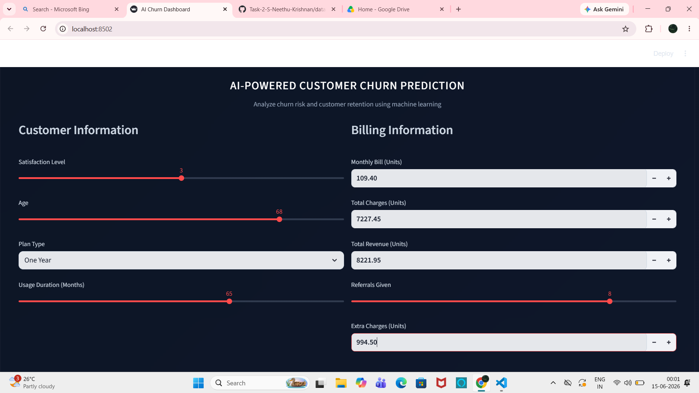
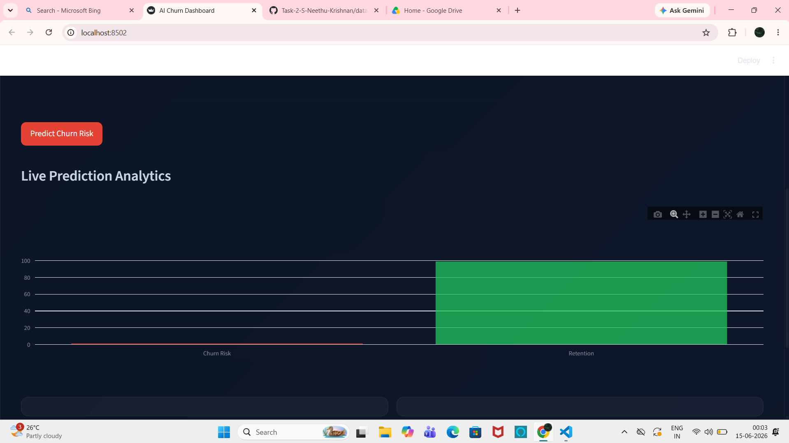
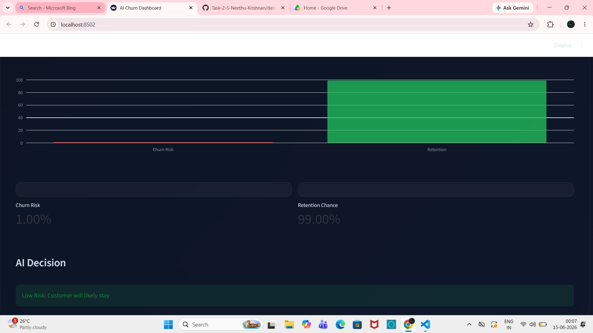
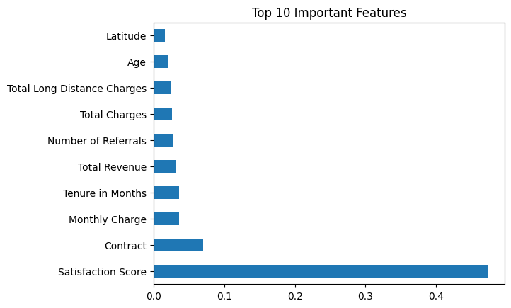
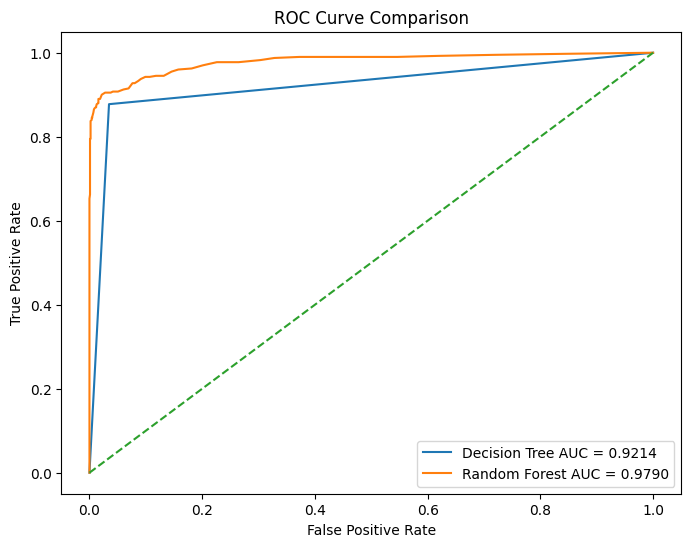
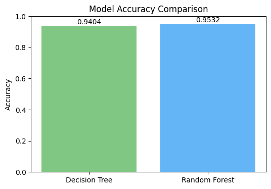
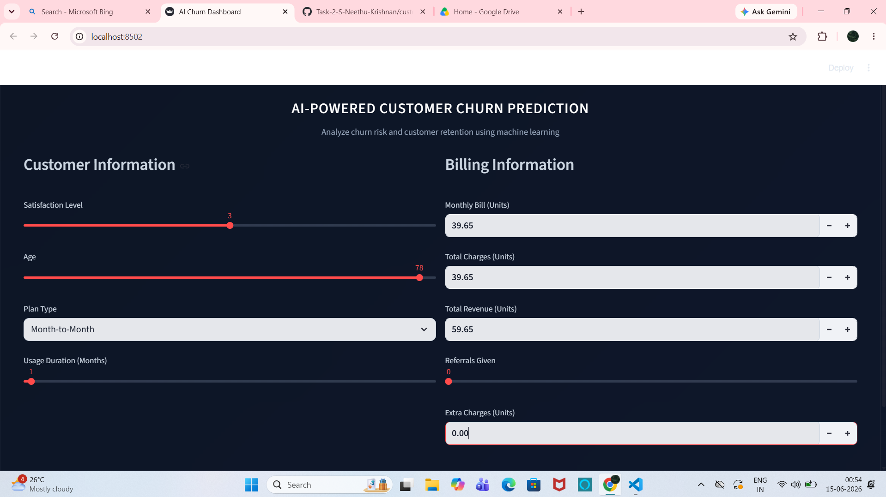
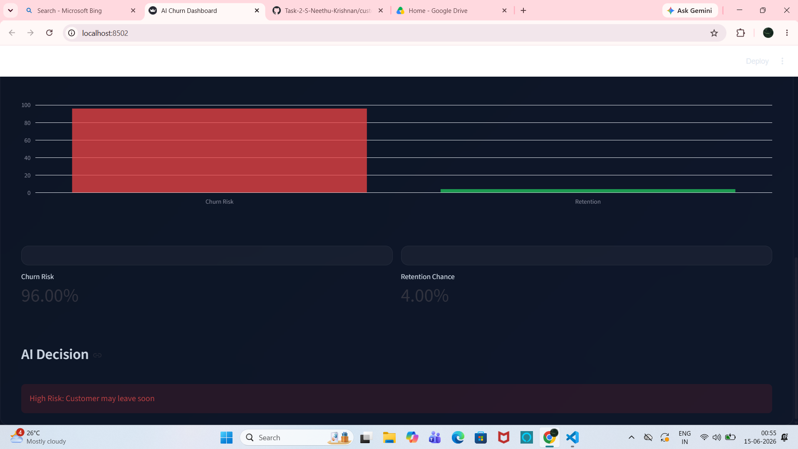

# Customer Churn Prediction

## Dataset
Telco Customer Churn Dataset

## Models Used
- Decision Tree Classifier
- Random Forest Classifier

## Evaluation Metrics
- Accuracy
- F1 Score
- Confusion Matrix
- ROC-AUC

## Results
- Decision Tree Accuracy: 94.04%
- Random Forest Accuracy: 95.32%

## Best Model
Random Forest Classifier

## Deployment
Streamlit-based customer churn prediction application.

## Saved Models
- `best_churn_model.pkl` → Full-feature Random Forest model used during model evaluation (Accuracy: 95.32%).
- `churn_model_streamlit.pkl` → Optimized deployment model trained using selected high-impact features (Accuracy: 94.46%, F1 Score: 0.8946).

## Files
- app.py
- customer_churn.ipynb
- best_churn_model.pkl
- churn_model_streamlit.pkl
- encoders.pkl
- requirements.txt
- dataset/telco.csv

## Project Screenshots

### Customer Input

### Prediction Analytics

### Prediction Result

### Feature Importance Analysis

### ROC Curve Comparison

### Model Accuracy Comparison

### High-Risk Customer Input

### High-Risk Prediction Result

## Final Conclusion

Two machine learning models were developed and evaluated for customer churn prediction using the Telco Customer Churn Dataset.

The Random Forest Classifier achieved the highest performance with an accuracy of 95.32%, outperforming the Decision Tree Classifier.

For deployment, an optimized model was trained using selected high-impact features, achieving 94.46% accuracy while reducing model complexity and maintaining strong predictive performance.

The system successfully predicts customer churn risk, provides probability-based insights, and supports proactive customer retention strategies.

## Project Status

The customer churn prediction system has been successfully developed, evaluated, and deployed. The application is ready for real-time customer churn analysis and retention decision support.

## Author

S NEETHU KRISHNAN